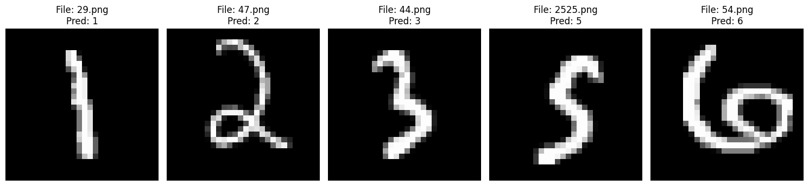
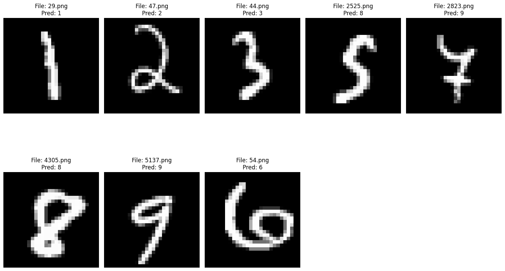
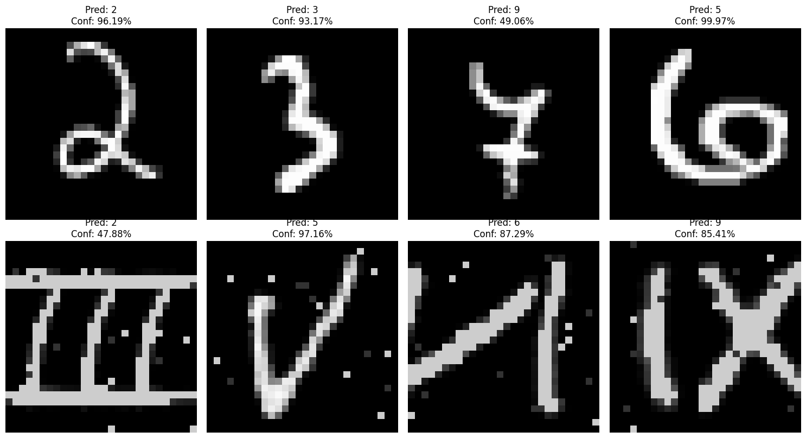

# Unified Digit & Roman Numeral Classifier 🚀

A comprehensive Deep Learning project implementing a multi-stage training pipeline (Pre-training, Transfer Learning, and Fine-tuning) to recognize both **English Digits (0-9)** and **Roman Numerals (I-IX)** using the AlexNet architecture.

## 📌 Project Overview

This project demonstrates how to train a single model to handle multiple domains (Arabic digits and Roman numerals) without "Catastrophic Forgetting." The pipeline is divided into three critical stages:

1.  **Pre-training**: Training on Arabic digits `0-6`.
2.  **Transfer Learning**: Training on Arabic digits `7-9` while preserving knowledge of `0-6` using gradient masking.
3.  **Fine-tuning**: Training on Roman numerals `i-ix` with domain adaptation (image inversion).

---

## 🛠️ Tech Stack & Architecture

-   **Model Architecture**: [AlexNet](https://pytorch.org/hub/pytorch_vision_alexnet/)
-   **Framework**: PyTorch
-   **Optimization**: Adam Optimizer
-   **Preprocessing**: Interpolation (224x224), Normalization, and Image Inversion for Roman numerals.

---

## 🚀 Training Pipeline

### 1. Pre-training (`0-6` Digits)
- **Script**: `pre_training.py`
- **Goal**: Establish a base model for digits.
- **Dataset**: MNIST-like `digit_train.csv`.
- **Output**: `pretrain.pth`

### 2. Transfer Learning (`7-9` Digits)
- **Script**: `transfer learning.py`
- **Goal**: Extend the model's knowledge to digits 7, 8, and 9.
- **Innovation**: Uses **Gradient Masking** on the classifier layer to ensure previously learned weights for `0-6` remain unchanged.
- **Output**: `transfer.pth`

### 3. Fine-tuning (Roman Numerals `i-ix`)
- **Script**: `fine-tuning.py`
- **Goal**: Map Roman numerals to their integer values (e.g., 'iii' → 3).
- **Domain Adaptation**: Includes automatic image inversion (light-to-dark conversion) to match the model's digit training domain.
- **Output**: `finetuned.pth`

---

## 📁 File Structure

```bash
├── digit_train.csv       # Dataset for English Digits
├── droman_train.csv      # Dataset for Roman Numerals
├── pre_training.py       # Stage 1: Initial training
├── transfer learning.py  # Stage 2: Transfer learning with masking
├── fine-tuning.py        # Stage 3: Domain adaptation for Roman Numerals
├── pretrain.pth          # Weights after Stage 1
├── transfer.pth          # Weights after Stage 2
├── finetuned.pth         # Final weights after Stage 3
├── PT-Testing/           # Test images for Pre-training
├── TL-Testing/           # Test images for Transfer Learning
└── FT-Testing/           # Test images for Fine-tuning
```

---

## ⚙️ Setup & Installation

1. **Clone the Repo**:
   ```bash
   git clone https://github.com/your-username/PT_TL_FT.git
   cd PT_TL_FT
   ```

2. **Install Dependencies**:
   ```bash
   pip install torch torchvision pandas numpy matplotlib pillow
   ```

3. **Run the Pipeline**:
   ```bash
   python pre_training.py
   python transfer learning.py
   python fine-tuning.py
   ```

---

## 📊 Results

The model achieves high accuracy across both domains. The fine-tuning stage specifically handles the mapping of Roman symbols to mathematical integers, allowing for a unified prediction interface.

| Domain | Example Input | Prediction |
| :--- | :--- | :--- |
| **English Digit** | `7` | `7` |
| **Roman Numeral** | `viii` | `8` |

---

## 🖼️ Visualizations

Here are some sample predictions from each stage of the training:

### Pre-training (Digits 0-6)


### Transfer Learning (Digits 7-9)


### Fine-tuning (Roman Numerals i-ix)


---

## 🤝 Contributing
Feel free to fork this project and submit pull requests. For major changes, please open an issue first to discuss what you would like to change.

## 📝 License
[MIT](https://choosealicense.com/licenses/mit/)
